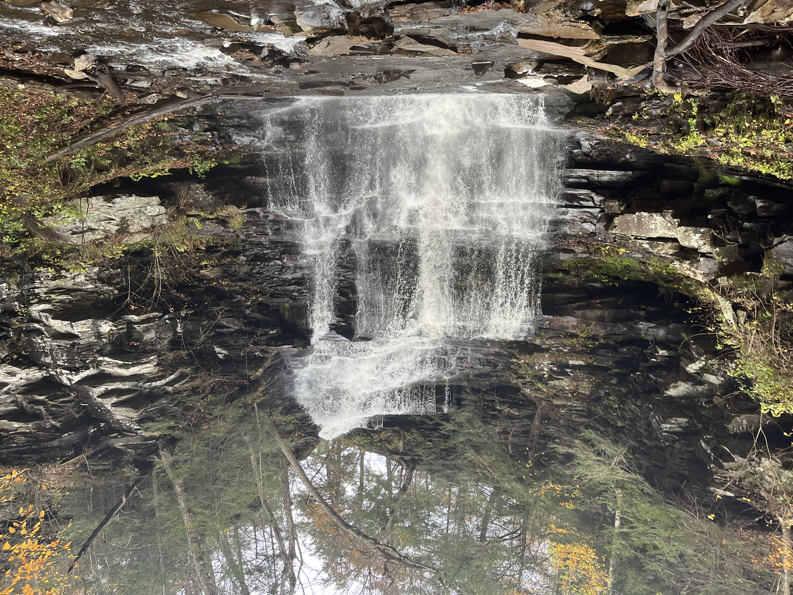
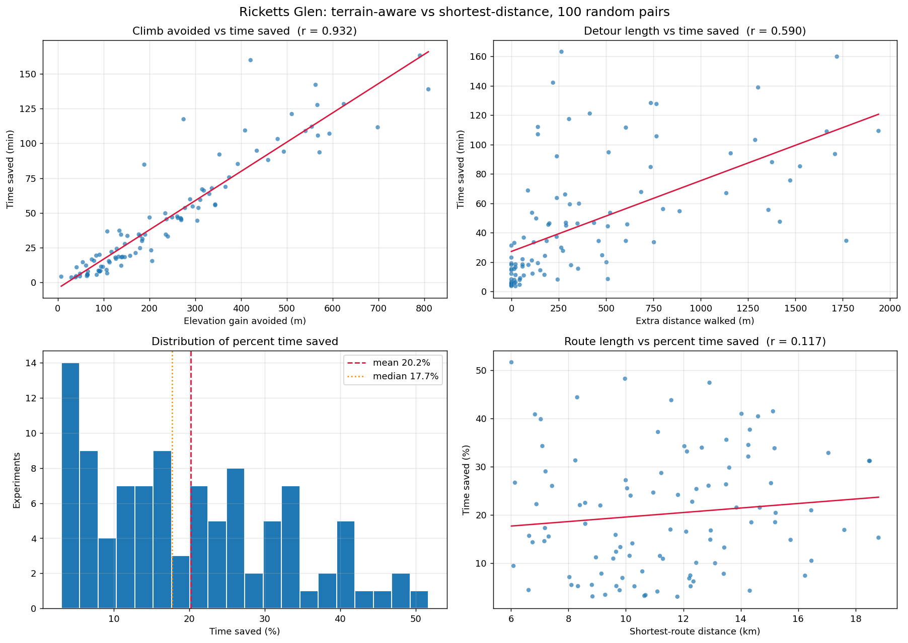
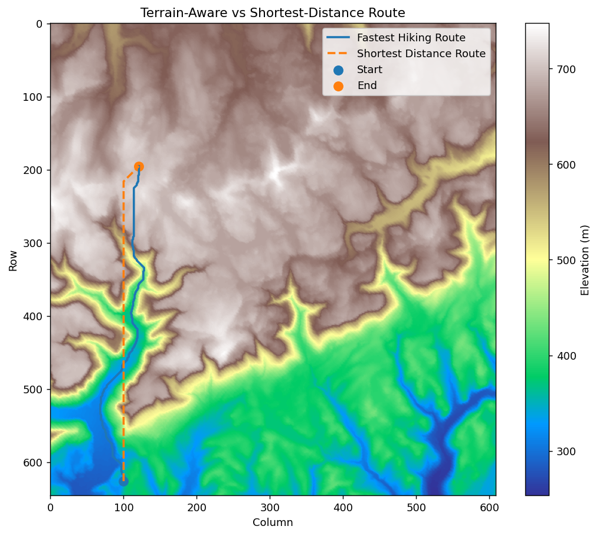
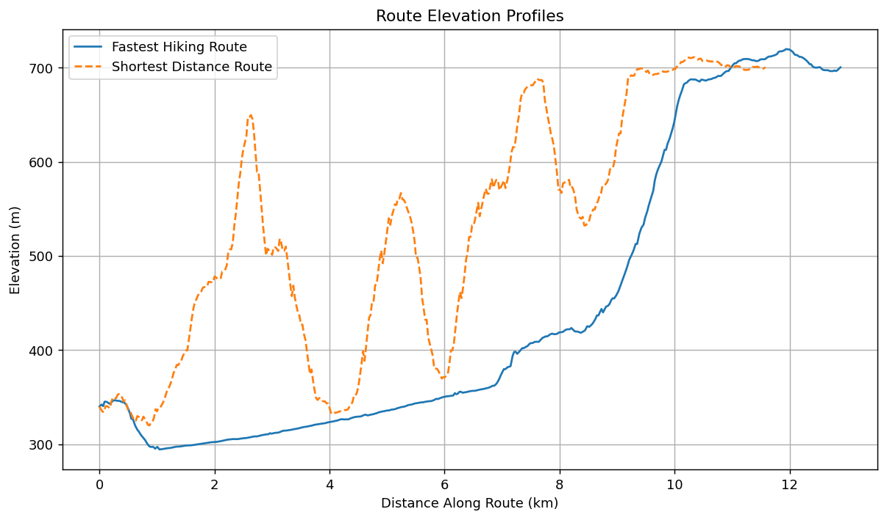

# Review of: Three Presentations on Geographical Analysis and Modeling: Non-Isotropic Geographic Modeling; Speculations on the Geometry of Geography; and Global Spatial Analysis (Tobler, 1993)

## 1. Introduction

The distance between two points on the Earth is often not as simple as the straight-line distance between their coordinates. The Earth is not a flat plane; it has bumps, peaks, and valleys. Tobler asks why we don't build geographical models around that fact rather than treating it as an inconvenience.

It costs to travel, whether it is gas, calories, or the price of a plane ticket. Geographic movement cost is not necessarily **isotropic**. Isotropic means the conditions are the same in every direction, so movement or distance behaves equally no matter which way you go. Imagine a smooth flat plane $1km \times 1km$. The cost to travel east would take the same amount of time as traveling north. But imagine we put a large mountain to the north. Our travel times would not be the same. Heading north, we would have to scale up and over a mountain. That takes a lot of energy.

So we ask: how does terrain-aware routing differ from shortest-distance routing? Here I use a real elevation raster, Tobler's hiking function, **Dijkstra's algorithm**, and a comparison against shortest-distance routing.

## 2. Background / Tobler's Model

This difference in travel cost depending on direction is the main idea behind Tobler’s non-isotropic geographic model. Rather than taking distance as having the same cost in every direction, Tobler takes into account factors such as terrain and slope. One of the ways he shows this is through his **hiking function**, which estimates speed based on the slope of the terrain.

$$
v=6e^{-3.5|s+0.05|}
$$

Where,

- $v =$ walking speed (in km/h)
- $s = \frac{rise}{run}$, i.e. slope

An important note is the $+0.05$. If you are on a slight decline, you are naturally going to move a bit faster. Tobler predicts maximum walking speed on a slight downhill of about a 5% grade.

## 3. Data

For the implementation, I used Digital Elevation Models (DEMs) from the USGS 3D Elevation Program (3DEP), downloaded using the `py3dep` Python library. Ricketts Glen in northeastern Pennsylvania was used as the primary area while developing and testing the implementation. Additional DEMs were later collected for Lehigh Gorge, the Delaware Water Gap, the Catskills, the Adirondacks, and Mount Washington for the larger experiment.

  

The elevation data was stored as GeoTIFF rasters, where each cell represents the elevation of a small area of terrain.

The Ricketts Glen raster contained 646 rows and 609 columns and used the EPSG:5070 projected coordinate reference system. Each raster cell was approximately $26.34m \times 26.34m$. Because the coordinate system is projected in meters, the physical distance between neighboring cells could be calculated directly. Horizontal and vertical neighbors were approximately $26.34m$ apart, while diagonal neighbors were approximately

$$
\sqrt{26.34^2 + 26.34^2} \approx 37.25m
$$

apart.

Each cell contained a single elevation value in meters. These elevation values were used to calculate the change in elevation between neighboring cells, which was then used to calculate slope.

The DEM was treated as the geographic environment for the routing experiments. Instead of using existing roads or hiking trails, movement was allowed directly across the raster so the experiment could focus specifically on how elevation and slope influence route choice.

## 4. Methodology

### 4.1 Raster Graph Construction

The DEM was represented as a graph where each raster cell acted as a node. Each cell was connected to its eight surrounding neighbors, allowing movement horizontally, vertically, and diagonally. The distance between neighboring cells was determined using the raster resolution given in the `.tif` file. As mentioned above, horizontal and vertical cells were approximately $26.34m$ apart, while diagonal cells were approximately $37.25m$ apart.

### 4.2 Slope and Travel Cost

For every possible movement between neighboring cells, the change in elevation was calculated. The slope was calculated as:

$$
s = \frac{\Delta elevation}{horizontal\ distance}
$$

This slope was then passed into Tobler's hiking function to estimate walking speed. From the estimated speed and distance between cells, a travel time was calculated and used as the cost of moving between those cells.

### 4.3 Pathfinding

Dijkstra's Algorithm was used to find the lowest-cost route between a starting cell and an ending cell. The starting node was initialized with a cost of $0$, while all other nodes were initialized to $\infty$. The algorithm repeatedly selected the node with the lowest known total cost and checked each of its neighboring cells.

If traveling through the current node produced a lower cost for a neighbor, that neighbor's cost and parent node were updated. This continued until the destination was reached, after which the stored parent nodes were followed backward to reconstruct the final path.

For the terrain-aware route, the edge cost was estimated travel time using Tobler's hiking function. For the shortest-distance route, the edge cost was simply the physical distance between cells.

## 5. Experimental Design

To determine whether the results from Ricketts Glen also appeared in other terrain, the same routing comparison was run across six study areas: Ricketts Glen, Lehigh Gorge, the Delaware Water Gap, the Catskills, the Adirondacks, and Mount Washington.

For each area, 100 random start and end cells were selected. Each pair was required to be at least one quarter of the grid's diagonal apart so that the routes were long enough to provide a meaningful comparison.

Dijkstra's algorithm was run twice for every pair. The terrain-aware version used Tobler's estimated hiking time as the edge cost, while the shortest-distance version used physical distance. The two routes were then compared using total distance, estimated hiking time, elevation gain, and elevation loss.

A fixed random seed was used so that the experiment could be reproduced, and the results for each study area were saved to separate CSV files.

## 6. Results

### 6.1 Overall Results

The terrain-aware routes were generally longer than the shortest-distance routes, but often resulted in lower estimated hiking times by avoiding steep terrain and unnecessary elevation gain.

  

### 6.2 Ricketts Glen Example

One Ricketts Glen run showed a particularly large difference between the two routing methods.

  

  

### Run 47

**Start:** `(row 626, col 100)`

**End:** `(row 195, col 121)`

| Metric | Terrain-Aware Route | Shortest-Distance Route |
| --- | ---: | ---: |
| Cells Traversed | 433 | 432 |
| Distance | **12.885 km** | **11.582 km** |
| Estimated Time | **177.99 min** | **316.85 min** |
| Elevation Gain | **465.7 m** | **1,274.7 m** |
| Elevation Loss | **105.4 m** | **914.4 m** |

### Comparison

| Difference | Result |
| --- | ---: |
| Additional Distance | **1.303 km** |
| Distance Increase | **11.25%** |
| Time Saved | **138.86 min** |
| Time Reduction | **43.82%** |
| Elevation Gain Avoided | **809.1 m** |

Although the terrain-aware route traveled approximately **1.3 km farther**, it reduced the estimated hiking time by nearly **139 minutes**, or about **2 hours and 19 minutes**. The terrain-aware route also avoided approximately **809 meters of elevation gain**.

## 7. Discussion
The results demonstrate that the shortest route by distance is not necessarily the most efficient route for hiking when elevation and slope are considered. In many cases, the terrain aware path took a longer path, but avoid a substantial amount of elevation gain. This reduced the hiking time even though our distance was longer. 

Run 47 was a good example of this. The terrain-aware route added about 1.3 km of distance, but avoided over 800 m of elevation gain and reduced the estimated travel time by more than two hours. This shows that using distance alone can be misleading when routing through mountainous area.

The results also support Tobler's idea of non-isotropic geographic movement. Traveling through geographic space has a cost that depends on the terrain and direction of movement. Two routes with similar distances can have very different travel times.

## 8. Limitations
This implementation only took into account elevation and slope when determining the travel cost. In the real world hiking speed is affected based on many factors like trails, vegetation, rocks, water, ground conditions, and other obstacles. The model currently allows a route to travel through any cell, even if that location would be difficult or impossible to cross in reality.

The accuracy of the routes is also limited by the resolution of the DEM and the used of the eight-neighbor grid. Movement is restricted to horizontal, vertical, and diagonal directions rather than allowing completely continuous movement across the landscape.

Finally, the hiking times in these experiments are estimates produced using Tobler's hiking function. They were not compared against actual recorded hiking times, so the results show differences predicted by the model rather than guaranteed real-world time savings.

## 9. Conclusion
This project showed an implementation of Tobler's non-isotropic geographic model using real elevation data and Dijkstra's algorithm. By using Tobler's hiking function as the travel cost, the terrain-aware routes were able to avoid steeper terrain and, in many cases, reduce estimated hiking time compared with shortest-distance routes.

While these results were based on modeled travel times rather than field-tested routes, Tobler's hiking function provides a useful estimate of how slope can affect movement through geographic space. Overall, the implementation shows why distance alone is not always enough when modeling travel across real terrain.

## References

Tobler, W. (1993). *Three Presentations on Geographical Analysis and Modeling: Non-Isotropic Geographic Modeling; Speculations on the Geometry of Geography; and Global Spatial Analysis* (93-1). UC Santa Barbara: National Center for Geographic Information and Analysis. Retrieved from [https://escholarship.org/uc/item/05r820mz](https://escholarship.org/uc/item/05r820mz)